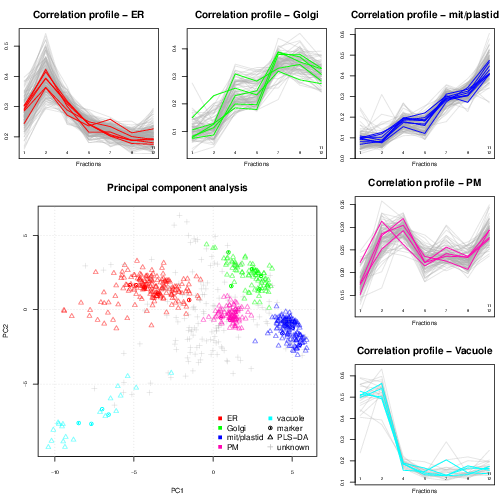
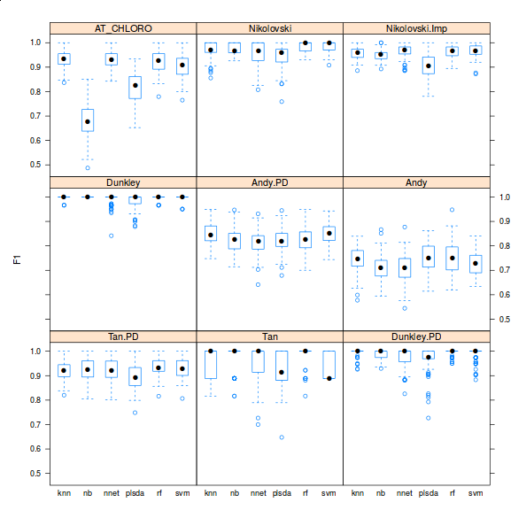
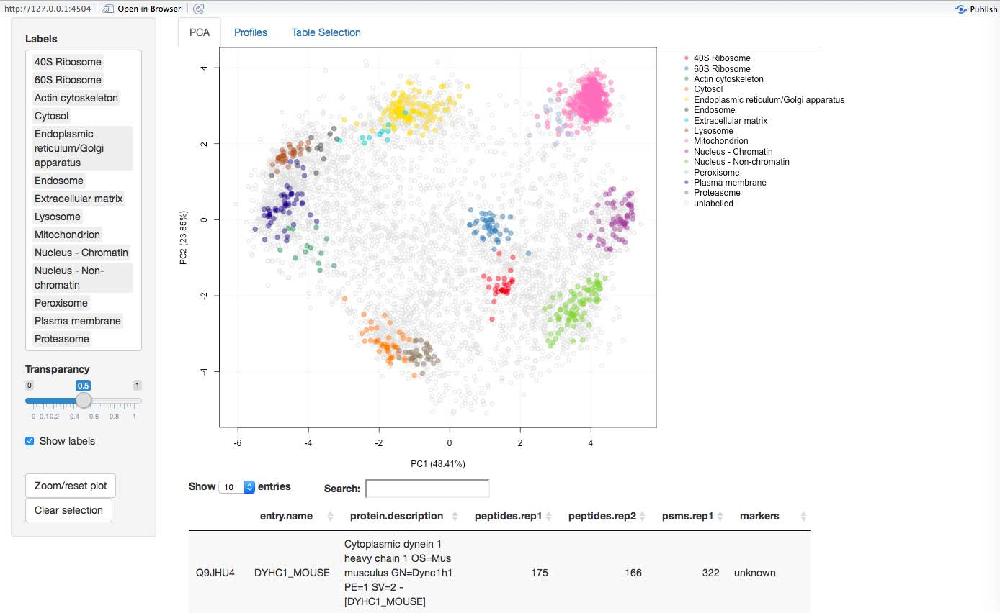
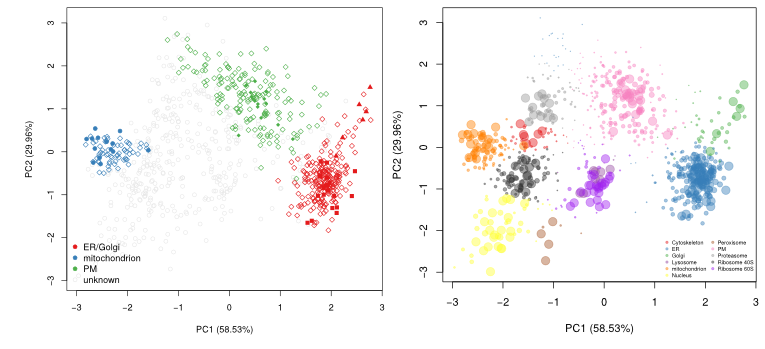
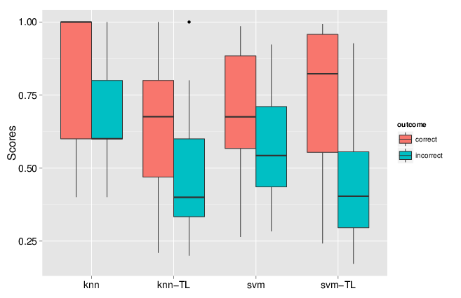
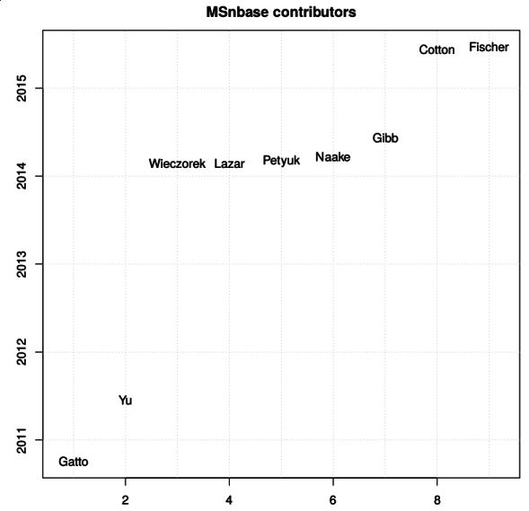
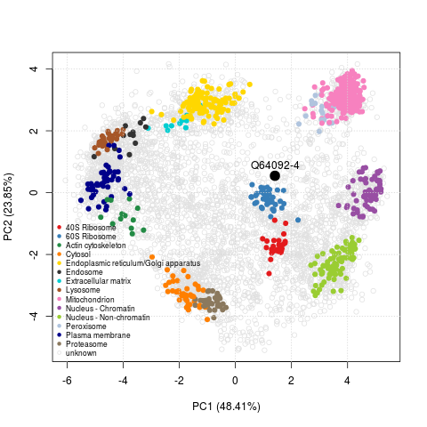
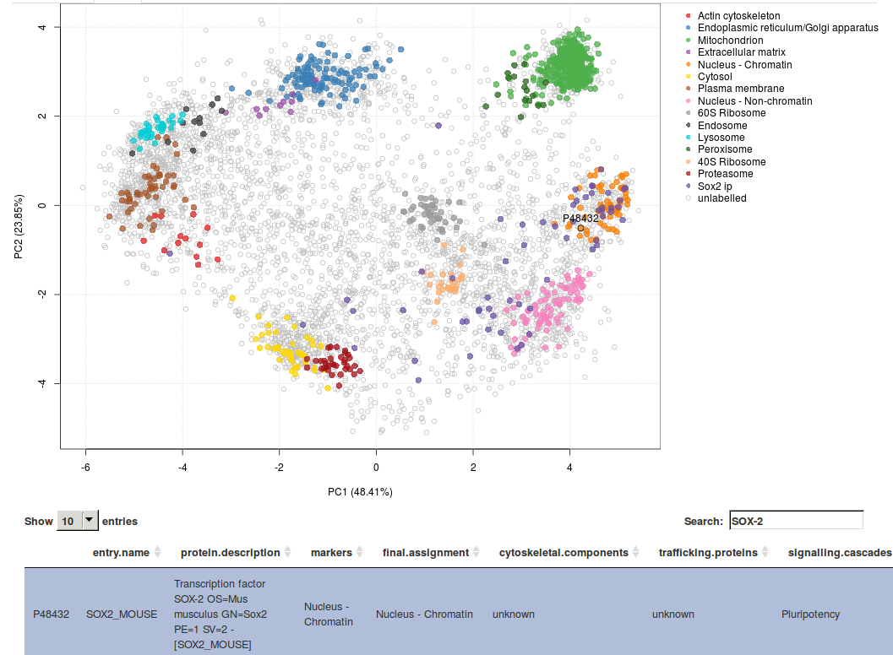
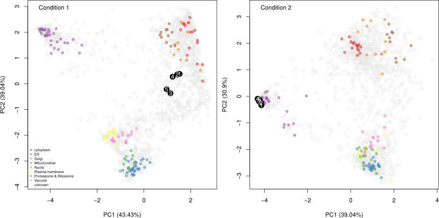

What have we achieved so far? We are Lisa Breckels and Laurent Gatto
at the
[Computational Proteomics Unit (CPU)](http://cpu.sysbiol.cam.ac.uk/),
the University of Cambridge. This post summarises some of our progress
in spatial proteomics since 2010, the year (October and January
respectively) when we joined the
[Cambridge Centre for Proteomics](http://proteomics.bio.cam.ac.uk/),
and later, in 2013, when the CPU was set up.

<!--more-->



## Spatial proteomics

Spatial proteomics is the systematic study of protein sub-cellular
localisation. Here, we will focus on high throughput approaches, based
on sub-cellular fractionation and quantitative mass spectrometry. In a
nutshell, the plasma membrane of cells is firstly disrupted so as to
release their intact content, including organelles, vesicles and
macro-molecular complexes. This sub-cellular content is then separated
using, for example, a continuous density gradients and a set of
discrete fraction are collected along the continuous
gradient. Fractions towards the end of the gradient will be enriched
in dense sub-cellular compartments that migrated further down the
gradient, while fractions from the top of the gradient will be
enriched in lighter, less dense compartments. The proteins contained
in the discrete fractions are then extracted, identified and
quantified using mass spectrometry. The relative protein intensities
along the gradient (see top and right on the figure
below) can then be used to recreate the original organelle-specific
profiles. By matching protein profiles (grey profiles below) to those
of marker proteins, i.e. genuine and well-known residents of
specific compartments (coloured profiles), it is possible to assign
un-labelled proteins to their sub-cellular localisation. Rather than
visualising data along multiple line plots, we prefer to summaries all
the data on a principal component analysis (PCA) plot (or other
dimensionality reduction methods).

See *Organelle proteomics experimental designs and analysis*
([Gatto et al. (2010)](http://www.ncbi.nlm.nih.gov/pubmed/21080489))
for a general introduction to spatial proteomics.

## Classification, software and reproducibility

The most direct analysis that one would do with spatial proteomics
data is to assign proteins of unknown localisation to one of the
labelled classes, i.e. organelles, defined by the annotated marker
proteins. This is a straightforward application for supervised machine
learning, i.e. classification. 

Before summarising our contributions on that front, it is worth noting
that, despite this being, in many respects, the *main* analysis that
will address the key questions of such experiments, this is not the
part of the analysis that will be most time consuming. On the
contrary (there are other more important issues to tackle or improve), 
and this is pretty much a solved issue, that can be settled over
coffee. 

Below, I reproduce (with re-formatted references and links) an excerpt
from our 2014 paper
[*A foundation for reliable spatial proteomics data analysis*](http://www.ncbi.nlm.nih.gov/pmc/articles/PMC4125728/).

> The first applications of large-scale organelle proteomics data
> analysis were protein correlation profiling efforts
> ([Foster et al. (2006)](http://www.ncbi.nlm.nih.gov/pubmed/16615899/),
> [Andersen et al. (2003)](http://www.ncbi.nlm.nih.gov/pubmed/14654843/))
> that calculated a $$ \chi^2 $$ metric using in-house tools and LOPIT
> ([Dunkley et al. (2006)](http://www.ncbi.nlm.nih.gov/pubmed/16618929/),
> [Tan et al. (2009)](http://www.ncbi.nlm.nih.gov/pmc/articles/PMC2690488/),
> [Hall et al. (2009)](http://www.ncbi.nlm.nih.gov/pmc/articles/PMC2690488/))
> that applied partial least squares discriminant analysis using the
> commercial SIMCA software (Umetrics, Umea,
> Sweden). [Trotter et al. (2010)](http://www.ncbi.nlm.nih.gov/pubmed/21058340/)
> implemented custom [R](https://www.r-project.org/) code and used the
> SVM algorithm from the
> [kernlab package](https://cran.r-project.org/web/packages/kernlab/),
> but no code for others to repeat this state-of-the-art procedure is
> provided. Others have applied other contemporary machine learning
> algorithms, including random forests
> ([Ohta et al.(2010)](http://www.ncbi.nlm.nih.gov/pmc/articles/PMC2982257/)),
> naive Bayes
> ([Nikolovski et al. (2012)](http://www.ncbi.nlm.nih.gov/pmc/articles/PMC3461528/)),
> and neutral networks
> ([Tardiff et al. (2012)](http://www.ncbi.nlm.nih.gov/pubmed/22826458/)),
> but did not provide means to apply their analyses to new
> data. Although proteomics data are commonly being disseminated
> through appropriate repositories, it is not commonplace to provide
> reproducibility in terms of software and data analysis, despite
> their recognised importance
> ([Aebersold (2011)](http://www.ncbi.nlm.nih.gov/pmc/articles/PMC3226393/)).

There are however three important facts about these classification
analyses that are never highlighted in the literature. First, there is
very little or no attempt to offer access to code and the ability to
reproduce the analyses. Second, the crucial parameter optimisation
step is hardly addressed (see the
[pRoloc software](http://bioconductor.org/packages/release/bioc/html/pRoloc.html)
and our reference above for details). Finally, possibly in an
attempt to emphasise novelty in using other algorithms for the first
time in such a context, it generally doesn't matter what algorithms is
used, as long as it is used adequately (see second point). Below is a
figure taken from one of the
[pRoloc](http://bioconductor.org/packages/release/bioc/html/pRoloc.html)
vignettes (manuals), that shows classifier accuracy metrics (F1 on the
y axis) for various classifiers (k-nearest neighbours, naive Bayes,
neural networks, partial least square discriminant analysis, random
forests and support vector machines) for 9 different data sets
(available in the
[pRolocdata](http://bioconductor.org/packages/release/data/experiment/html/pRolocdata.html)
package).

We have designed the
[pRoloc](http://bioconductor.org/packages/release/bioc/html/pRoloc.html)
([Gatto et al. (2014)](http://www.ncbi.nlm.nih.gov/pmc/articles/PMC3998135/))
software to support the consistent and reproducible analysis of such
data.

## Data handling, processing and visualisation

In addition to the classification of proteins of unknown localisation,
we have developed a complete suite of data structures and data
processing methods to explore quantitative proteomics data
([Gatto et al. (2012)](http://bioinformatics.oxfordjournals.org/content/28/2/288.long)),
such as our spatial proteomics experiments. An important aspect of
this data exploration is the visualisation of spatial proteomics data
using profile plots (to visualise the protein) and PCA plots. These
have proven invaluable to inspect the quality of data, assess the
separation along the density gradient and the compartment-specific data
clusters, and, ultimately, to critically assess the results of the
classification analysis.

More recently, we have been working on interactive interfaces (see for
example [here](https://lgatto.shinyapps.io/christoforou2015)) to
explore the data, available in the
[pRolocGUI](http://bioconductor.org/packages/devel/bioc/html/pRolocGUI.html)
package. The screen shot below illustrates the PCA interfaces that
supports zooming, selection of sub-cellular niches to be displayed,
searching, feature selection (by clicking points on the figures
and lines in the feature table) to cite a few.

## New algorithms

We have also developed novel algorithms to reveal new features and shed
new light on these spatial proteomics data sets. All these new
algorithms are readily available and documented in the
[pRoloc](http://bioconductor.org/packages/release/bioc/html/pRoloc.html)
software.

### Novelty detection

In
[Breckels et al. (2013)](http://www.ncbi.nlm.nih.gov/pubmed/23523639),
we published a semi-supervised novelty detection algorithm, coined
*phenoDisco*, that mines the quantitative data for un-annotated data
clusters to reveal sub-cellar niches that were not identified by the
user (i.e. there were no protein markers for that specific
sub-cellular compartments).

The figure below shows the application of the
[`phenoDisco`](http://www.rdocumentation.org/packages/pRoloc/functions/phenoDisco)
function on fly data from
[Tan et al. (2009)](http://www.ncbi.nlm.nih.gov/pmc/articles/PMC2690488/). Initially,
3 sub-cellular cluster were annotated, one of which combined ER and
Golgi (left). We re-analysed the same quantitative data matrix (right)
and identified a total of 12 sub-cellular niches, including ribosomal
clusters and deconvoluted the ER/Golgi clusters. In addition, on the
figure below, we used the classification score (SVM in this case) to
adjust the point size, to reflect better (larger points) prediction
accuracy.

### Transfer learning

More recently in
[Breckels et al. (2015)](http://biorxiv.org/content/early/2015/07/07/022152),
we published a transfer learning algorithm that combines heterogeneous
data such as mass spectrometry-based spatial proteomics data (our
primary data, expensive to produce but of high quality and specific to
a biological system and conditions of interest) and a secondary data
source (generally readily available from third party resources) such
as gene ontology annotations or sub-cellular imaging data (from the
[Human Protein Atlas](http://www.proteinatlas.org/), for example) to
improve upon the assignment of proteins to their sub-cellular niche.

We implemented two approaches, one based on nearest neighbours that
optimises weights for different data sources and different
sub-cellular niches, and one based on support vector machines,
utilising separate Gaussian kernels for the two data sources. We
showed that combining these heterogeneous data sources substantially
improves the classification accuracy. One particularly useful feature
of the transfer learning was the improvement of the discrimination of
true and false positives. Indeed, running a classification algorithm
will classify every un-labelled protein to one of the labelled
classes (sub-cellular niches). One can however never guarantee that
all sub-cellular niches are present and it is widely known that
proteins reside in multiple locations. As
such, it is crucial to carefully set classification score thresholds
to minimise false positive assignments. In the figure below, we
compared the classification scores for one data classifier (knn
or svm) to the data transfer learning version (knn-tl or
svm-tl) using data for which true localisation was known, and compared
correct and incorrect outcomes. We see that the separation between
these correct an incorrect outcomes scores is greater for the transfer
learning algorithms: it becomes much easier to set score thresholds
that minimise incorrect outcomes while still maximising the number of
correct predictions.

## Software

An important achievement, that is not immediately obvious from
research papers, is the data management and analysis infrastructure
that we can rely on. In a matter of minutes, using our software, one
can generate an annotated R object (an
[`MSnSet`](http://www.rdocumentation.org/packages/MSnbase/functions/MSnSet-class))
from an arbitrary
[spreadsheet](http://www.rdocumentation.org/packages/MSnbase/functions/readMSnSet),
if there already is one for the existing data, and 
[add markers](http://www.rdocumentation.org/packages/pRoloc/functions/addMarkers)
if they are not readily available, to visualise, explore and assess the
quality of the data. If appropriate, we can then readily run various
analyses such as
[classification](http://www.rdocumentation.org/packages/pRoloc/functions/svmClassification),
[novelty detection](http://www.rdocumentation.org/packages/pRoloc/functions/phenoDisco)
or
[transfer learning](http://bioconductor.org/packages/devel/bioc/vignettes/pRoloc/inst/doc/pRoloc-transfer-learning.pdf). This
brings the analysis of spatial proteomics data on par with shotgun
proteomics or transcriptomics data, where easy things are
straightforward to do, and can be done **consistently** and
**reproducibly**. This infrastructure also offers robust grounds for
more complex analyses and developments; for example, all the transfer
learning methods and visualisation (both static and interactive) would
have been substantially more difficult to implement and disseminate to
the wider community. As we are using generic and well-defined data
structures, it is straightforward to apply these methods to different
types of [experiment](http://www.ncbi.nlm.nih.gov/pubmed/26059426).

Another noteworthy aspect of our work is the open and collaborative
development of our software. Several packages that are used for the
analysis of quantitative spatial proteomics data, among others, have
benefited from a number of contributions. The figure below names the
contributors to the
[`MSnbase`](http://bioconductor.org/packages/devel/bioc/html/MSnbase.html)
(and [here](https://github.com/lgatto/MSnbase) on GitHub) package
since 2010 (the initial public release).

## Biology

Of course, what matters in the end, is how these progress impact on
the biology. Consistency, replicability and sound algorithmic
procedures can only have a positive impact on the validity of the
biological interpretation of these data. But recent advances in data
analyses as well as fractionation and mass spectrometry (*hyperLOPIT*,
see
[Christoforou et al. (2016)](http://www.nature.com/ncomms/2016/160112/ncomms9992/full/ncomms9992.html))
enables us to shed new lights on the spatial behaviour of proteins.

These high-throughput spatial proteomics experiments record the
steady-state distributions of transitory proteins, revealing
information about the state in the entire assessed cell
population. One example from
[Christoforou et al. (2016)](http://www.nature.com/ncomms/2016/160112/ncomms9992/full/ncomms9992.html)
is the Tfe3 transcription factor (Q64092-4), a modulator of the exit
of ES cells from pluripotency.  As shown on the figure below, we infer
a mixed localisation between the cytoplasm and nucleus from its
position on the PCA plot. This mixed localisation is consistent with
immunocytochemistry data in ES cells. In the pluripotent state, Tfe3
localises to both the nucleus and cytosol, and regulates the
expression of key pluripotency factor Esrrb. In the early stages of
differentiation, it is excluded from the nucleus
([Betschinger et al. (2013)](http://www.ncbi.nlm.nih.gov/pmc/articles/PMC3661979/)).

The PCA plot with Tfe3 can very easily be reproduced with the 9 lines
of codes transcribed below.



This hyperLOPIT spatial proteomics data enables exploration of many
additional cell features such as sub-organellar resolution, mapping of
vesicles and protein complexes, mapping of the sub-cellular
localisation of signalling cascade components (see for example the
screenshot from our [online
GUI](https://lgatto.shinyapps.io/christoforou2015) below, showing the
spatial overview of the interaction partners of pluripotency Sox2
factor) and protein isoforms with differential sub-cellular
localisation.

To further exploit these rich data, we organised a [LOPIT
hackathon](http://lgatto.github.io/ccp-lopit-hackathon/) to
collaboratively explore and understand the spatial organisation of
these cells.

## Future

There is still much more we hope to achieve. We have been [very
active](https://github.com/ComputationalProteomicsUnit/pRolocGUI/graphs/contributors?from=2015-09-22&to=2016-02-09&type=c)
in developing better interactive interfaces to explore spatial
proteomics data and plan offer dedicated infrastructure to widen
dissemination of such data (both from our groups in Cambridge and
others).

We have also recently applied for a [BBSRC Tools and Resources
development
fund](http://www.bbsrc.ac.uk/funding/filter/tools-and-resources-2015-call2/)
to develop a better statistical framework to reliably and
systematically identify mixed localisation (see the Tfe3 example
above) and changes in localisation upon perturbations, i.e. were
proteins exhibit different sub-cellar localisation patterns in
different conditions (see below).

